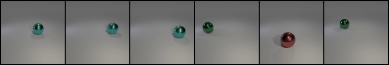
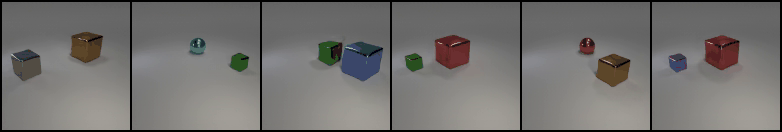
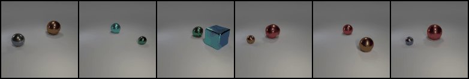

## OroJaR &mdash; ProgressiveGAN Regularization

[comment]: <> ([Paper]&#40;https://arxiv.org/abs/2108.07668&#41; | [ICCV 2021 Video]&#40;https://youtu.be/TnO_3Ng0Hhg&#41; | [ICCV 2021 Poster]&#40;../teaser_images/poster.pdf&#41;)

<a href="https://arxiv.org/abs/2108.07668"></a>
<a href="https://youtu.be/TnO_3Ng0Hhg"></a>
<a href="https://github.com/csyxwei/OroJaR/blob/master/teaser_images/poster.pdf"></a>
<a href="https://replicate.ai/csyxwei/orojar"></a>

[Home](https://github.com/csyxwei/OroJaR) | [PyTorch BigGAN Discovery](../biggan_discovery) | TensorFlow ProGAN Regularization | [PyTorch Simple GAN Experiments](../simplegan_experiments) 

---





This repo contains a TensorFlow implementation of the Orothogonal Jacobian Regularization applied to ProgressiveGAN. The code is based on the [Hessian Penalty](https://github.com/wpeebles/hessian_penalty), we thank the authors for their excellent work.  

## Setup

Follow the simple setup instructions [here](../README.md#getting-started). 

## Visualizing and Evaluating Pre-Trained Models

The pre-trained models of OroJaR are provided at [Google Drive](https://drive.google.com/drive/folders/1fi9mc-KxLmi-d39dQMFHc6acxFQvTaND) or [BaiduNetDisk](https://pan.baidu.com/s/1Kqa4rlOfxt6atoN1qrxU_w) (xwot). You can download and put them into [pretrained_models](./pretrained_models) folder. Other pre-trained models (e.g. Hessian Penalty, InfoGAN, vanilla ProGAN) can be found in [Hessian Penalty](https://github.com/wpeebles/hessian_penalty/tree/master/progan_experiments). To generate a high-quality interpolation video in the `visuals` directory, which shows what each `z` component has learned, you can simply run:

```python
python visualize.py --models model_paths --seed <0/1/2/3/4>
```

You can also specify multiple checkpoints to generate visuals for them simultaneously. There are several visualization options; see [`visualize.py`](visualize.py) for details and documentation.

To evaluate pre-trained models' PPLs and FIDs, you can use:

```python
python evaluate.py --model model_paths --dataset <DATASET>
```
where `<DATASET>` is one of `edges_and_shoes`, `clevr_simple`, `clevr_complex`, `clevr_u` or `clevr_1fov`. This command will automatically download the dataset from [Hessian Penalty](http://efrosgans.eecs.berkeley.edu/HessianPenalty/resources/) if needed and then evaluate FID and PPL. (Note that for `clevr_u` specifically, you should use `--model model_paths --dataset clevr_simple`, since `clevr_u` is just a model trained on `clevr_simple` with `nz=3`).

To evaluate pre-trained models' VP , you can first use following command to generate the paired images:

```python
python gen_pairs.py --model model_paths --seed <0/1/2/3/4>
```

Generated images will be saved to `pairs`. 
Then use this repository [VP-metric-pytorch](https://github.com/zhuxinqimac/VP-metric-pytorch) to get the VP score using the generated dataset. 
The hyperparams we used for testing is `lr:0.0005, batch_size:32, epochs:300, input_mode:concat, in_channels:6, test_ratio:0.9, out_dim:(3 for CLEVR-U and 12 for others)`. For CLEVR-Simple dataset, the paired images are generated from top six activeness score dimensions, see [`gen_pairs.py`](gen_pairs.py) for more details.  
You should run multiple times (e.g. 3) of this evaluation procedure to obtain an averaged score for your model.

Finally, if you'd like to compute activeness score histograms, you can use [`figures.py`](figures.py):

```python
python figures.py --models models_paths --fig active --samples 300 --model_names <names for histograms> --dataset_names <titles for histograms>
```

Figures will be saved to `visuals`.

## Training

If you'd like to train new models, the main entry point is [`train_orojar.py`](train_orojar.py). If you specify one of the datasets provided by [Hessian Penalty](http://efrosgans.eecs.berkeley.edu/HessianPenalty/resources/) with the `--dataset` argument (`edges_and_shoes`, `clevr_simple`, `clevr_complex` or `clevr_1fov`), it will be automatically downloaded to the `datasets` folder. Alternatively, you can set-up your own datasets with:

```python
python dataset_tool.py create_from_images datasets/<pick_a_dataset_name> <path_to_folder_of_images>
```

There are several options related to the OroJaR that can be controlled with command-line arguments. Some examples of arguments you can add:

* `hp_lambda`: Controls the loss weighting of the OroJaR
* `layers_to_reg`: Controls which layers (1 through 13) are regularized by the OroJaR
* `epsilon`: Controls granularity of finite differences approximation
* `num_rademacher_samples`: Controls how many samples are used to estimate the Jacobian matrix

We include the commands used to train OroJaR model from scratch in the [`training_scripts`](training_scripts) folder. 

To train a vanilla ProGAN, use `--hp_lambda 0`. To train with InfoGAN's regularizer, add `--infogan_lambda <loss_weighting> --infogan_nz <nz>`. This will regularize the first `nz` components of the `z` vector with InfoGAN's loss.

This code supports both Tensorboard and the [WandB](https://www.wandb.com/) dashboard. If you want to use WandB, specify `--dashboard_api wandb` and `--wandb_entity <entity/username>` in your call to `train.py`. Regardless of the dashboard you use, disentanglement visualizations, training losses, network checkpoints, and FID/PPL will be periodically computed and saved to `results`, which you can then view in your dashboard.

## Citation

If our code aided your research, please cite our [paper](http://arxiv.org/abs/2108.07668):
```
@InProceedings{Wei_2021_ICCV,
    author    = {Wei, Yuxiang and Shi, Yupeng and Liu, Xiao and Ji, Zhilong and Gao, Yuan and Wu, Zhongqin and Zuo, Wangmeng},
    title     = {Orthogonal Jacobian Regularization for Unsupervised Disentanglement in Image Generation},
    booktitle = {Proceedings of the IEEE/CVF International Conference on Computer Vision (ICCV)},
    month     = {October},
    year      = {2021},
    pages     = {6721-6730}
}
```

## Acknowledgments

This repo builds upon [Hessian Penalty](https://github.com/wpeebles/hessian_penalty) and [StyleGAN-v1 TensorFlow](https://github.com/NVlabs/stylegan) library. We thank the authors for open-sourcing their code. The original license can be found in [Hessian LICENSE](LICENSE-Hessian.txt) and [NVIDIA LICENSE](LICENSE-NVIDIA.txt).
