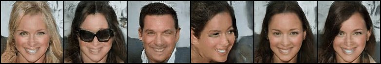
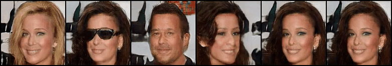

## OroJaR &mdash; Experiments on Dsprites

[comment]: <> ([Paper]&#40;https://arxiv.org/abs/2108.07668&#41; | [ICCV 2021 Video]&#40;https://youtu.be/TnO_3Ng0Hhg&#41; | [ICCV 2021 Poster]&#40;../teaser_images/poster.pdf&#41;)

<a href="https://arxiv.org/abs/2108.07668"></a>
<a href="https://youtu.be/TnO_3Ng0Hhg"></a>
<a href="https://github.com/csyxwei/OroJaR/blob/master/teaser_images/poster.pdf"></a>
<a href="https://replicate.ai/csyxwei/orojar"></a>

[Home](https://github.com/csyxwei/OroJaR) | [PyTorch BigGAN Discovery](../biggan_discovery) | [TensorFlow ProGAN Regularization](../progan_experiments) | PyTorch Simple GAN Experiments 

---





This repo contains a Pytorch implementation of the Orothogonal Jacobian Regularization applied to a Simple GAN on Dsprites and CelebA. The code is based on the [CycleGAN](https://github.com/junyanz/pytorch-CycleGAN-and-pix2pix), we thank the authors for their excellent work.  

## Setup

Follow the simple setup instructions [here](../README.md#getting-started). The pytorch version we have used to train the models is pytorch1.7.1.

## Visualizing and Evaluating Pre-Trained Models

The pre-trained models of OroJaR are provided at [Google Drive](https://drive.google.com/drive/folders/1fi9mc-KxLmi-d39dQMFHc6acxFQvTaND) or [BaiduNetDisk](https://pan.baidu.com/s/1x4ITjtslpAeM-iCMAPv06Q 
)(lg6v). You can download and put them into [pretrained_models](./pretrained_models) folder. To generate a interpolation video in the `visuals` directory, which shows what each `z` component has learned, you can simply run:

```python
python visualize.py --model_path model_path --model_name OroJaR --model_type gan --nz <input dimension> --nc_out <output channel>
```
where `model_name` is the subdir to save the videos, and `model_type` is used to specify the model used (`gan` for 64 x 64 Dsprites and `gan128` for 128 x 128 CelebA).  There are several visualization options; see [`visualize.py`](visualize.py) for details and documentation.

To evaluate pre-trained models' VP , you can first use following command to generate the paired images:

```python
python gen_pairs.py --model_path model_path --model_name OroJaR --model_type gan --nz <input dimension> --nc_out <output channel>
```

Generated images will be saved to `pairs`. Then use this repository [VP-metric-pytorch](https://github.com/zhuxinqimac/VP-metric-pytorch) to get the VP score using the generated dataset. The hyperparams we used for testing is `lr:0.0005, batch_size:32, epochs:300, input_mode:diff, in_channels:3, test_ratio:0.99, out_dim:(3 for Dsprites)`.  You should run multiple times (e.g. 3) of this evaluation procedure to obtain an averaged score for your model.

Finally, if you'd like to compute activeness score histograms, you can use [`activeness.py`](activeness.py):

```python
python activeness.py --model_paths model_paths \
--model_types <models to used>  \
--model_names <names for histograms> \
--dataset_names <titles for histograms> \
--nz <the input latent dimension> \
--nc_out <output channel>
```

You can also specify multiple checkpoints to generate activeness score histograms, and figures will be saved to `visuals/activeness`.

## Training

Firstly, you should download the dataset from [Dsprites](https://github.com/deepmind/dsprites-dataset/blob/master/dsprites_ndarray_co1sh3sc6or40x32y32_64x64.npz) or [CelebA](https://drive.google.com/file/d/0B7EVK8r0v71pZjFTYXZWM3FlRnM/view?usp=sharing&resourcekey=0-dYn9z10tMJOBAkviAcfdyQ) and put it into [dataset folder](./dataset).  Then, the main entry point to train new models is [`train.py`](train.py).

There are several options related to the OroJaR that can be controlled with command-line arguments. Some examples of arguments you can add:

* `reg_lambda`: Controls the loss weighting of the OroJaR
* `reg_type`: Controls the type of regularization to use, [orojar/vp/hp], default is `orojar`
* `nc_out`: Controls the output channels
* `dataroot`: Specify the dataset dir, deafult is `./dataset`
* `dataset_mode` Controls the dataset to use, [dsprites/celeba], default is `dsprites`
* `name`: Specify the experiment name, default is `OroJaR`
* `checkpoints_dir`: Specify the dir to save checkpoints, default is `./checkpoints`
* `epsilon`: Controls granularity of finite differences approximation
* `num_rademacher_samples`: Controls how many samples are used to estimate the Jacobian matrix

You can check `options/train_options.py` and `options/base_options.py` for more details. We include the commands used to train OroJaR model from scratch in the [`training_scripts`](training_scripts) folder. 

To train a vanilla GAN, use `--reg_type none`.  If you want to continue training the model, use `--continue_train` and use `--epoch_count` to spicify the start epoch.

This code supports the Tensorboard. If you want to use Tensorboard, use `--display_id 1`.

## Citation

If our code aided your research, please cite our [paper](https://arxiv.org/abs/2108.07668):
```
@InProceedings{Wei_2021_ICCV,
    author    = {Wei, Yuxiang and Shi, Yupeng and Liu, Xiao and Ji, Zhilong and Gao, Yuan and Wu, Zhongqin and Zuo, Wangmeng},
    title     = {Orthogonal Jacobian Regularization for Unsupervised Disentanglement in Image Generation},
    booktitle = {Proceedings of the IEEE/CVF International Conference on Computer Vision (ICCV)},
    month     = {October},
    year      = {2021},
    pages     = {6721-6730}
}
```

## Acknowledgments

This repo builds upon [CycleGAN](https://github.com/junyanz/pytorch-CycleGAN-and-pix2pix). We thank the authors for open-sourcing their code. The original license can be found in [CycleGAN LICENSE](LICENSE-CycleGAN).
